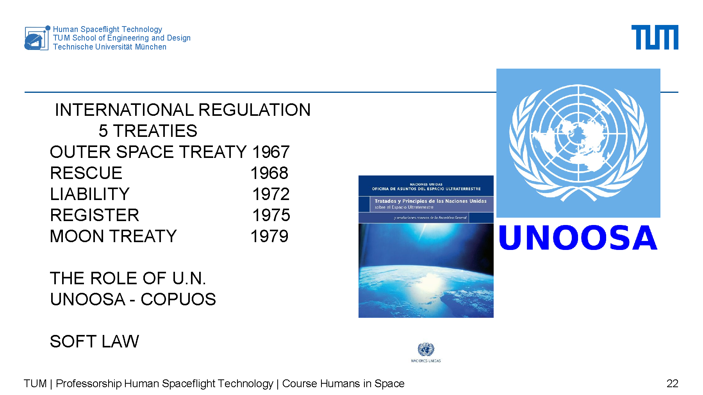

# Study Guide - Lecture 7: Space Law and Law Applied to Space Activities 🚀

## 1. Core Idea

Space law is not only "international law". It is the legal, political, economic and technical framework that shapes every space mission.

Remember this:

> A space mission is not designed with engineering alone. It also needs permits, liability rules, registration, radio spectrum coordination, export control, insurance, sustainability and geopolitical awareness.

## 2. Lecture Map 🧭

The presentation follows 8 main blocks:

1. Space law and law applied to space activities.
2. History of space activities: past, present and future.
3. The international space law environment.
4. National space regulations.
5. Legal issues in space operations.
6. Geopolitical aspects.
7. Space as an economic development zone.
8. Final remarks.

## 3. Basic Concepts

### Old Space vs New Space

- **Old Space**: traditional model led mainly by States, public agencies and large government programs.
- **New Space**: growing role of private companies, commercial launchers, constellations, private stations, lunar missions, space mining and new services.
- Main idea: opportunities are growing, but the legal and management complexity is growing too.

### Upstream vs Downstream

- **Upstream** = building and operating space infrastructure.
  - Launchers, spaceports, satellites, constellations, orbital stations, probes, lunar bases, propulsion, nuclear power, communications and radio spectrum.
- **Downstream** = using space-based services and data.
  - Applications, utilities, data services, information processing and commercial products.

Memory rule:

> **Upstream builds and operates. Downstream uses and applies.**

## 4. The 5 Main International Space Treaties 📜

Memorize the sequence:

> **OST - Rescue - Liability - Registration - Moon**

| Treaty | Year | Key Idea |
|---|---:|---|
| Outer Space Treaty | 1967 | Foundation of international space law. |
| Rescue Agreement | 1968 | Rescue and return of astronauts and space objects. |
| Liability Convention | 1972 | Liability for damage caused by space objects. |
| Registration Convention | 1975 | Registration of objects launched into space. |
| Moon Treaty | 1979 | Moon and celestial bodies; less widely accepted than the OST. |

Important institutions:

- **UN**: main international framework.
- **UNOOSA**: UN Office for Outer Space Affairs.
- **COPUOS**: UN Committee on the Peaceful Uses of Outer Space.
- **Soft law**: guidelines, principles and best practices that may not be binding but strongly influence behavior.

## 5. Key International Principles

These are the principles you should know:

- **Free access and use**: States may explore and use outer space.
- **Non-appropriation**: no State can claim ownership of outer space, the Moon or celestial bodies.
- **No territorial sovereignty**: outer space is not national territory.
- **State responsibility**: States are internationally responsible for national space activities, including private ones.
- **Natural resources in space**: important but legally and politically controversial.
- **New issues**: space debris, sustainability, private operators and space traffic management.
- **Militarization vs weaponization**:
  - Militarization = military or strategic use of space, such as communications, navigation or surveillance.
  - Weaponization = placing or using weapons in or from space.

Short version:

> Space is free to use, but not free to own. Even when companies act, States remain responsible.

## 6. Article VI of the Outer Space Treaty ⭐

This is one of the most important points in the lecture.

Article VI means:

- States are internationally responsible for their national activities in outer space.
- This includes activities carried out by private companies.
- Private space activities need **authorization** and **continuing supervision** by the appropriate State.

Practical consequence:

> If a company launches, operates or exploits a space activity, the State must authorize it, supervise it and may carry international responsibility for it.

## 7. National Space Regulation 🏛️

National law turns international principles into practical rules.

It usually includes:

- Space agencies.
- National space activity laws.
- Licenses and supervision systems.
- Safety, liability, insurance and environmental rules.
- Rules for dangerous activities.
- Sustainability and debris mitigation obligations.

Space companies also need normal business law:

- Corporate law.
- Contracts.
- Labor law.
- Tax law.
- Intellectual property.
- Real estate and facilities.
- Environmental regulation.

Other agreements or frameworks mentioned:

- ISS regulation.
- Artemis Program.
- ESA Convention.
- Artemis Accords / ILRS agreements.
- Luxembourg MoUs on space resources.

## 8. Legal Checklist for a Space Operation ✅

Before a mission, check:

1. **Launch**: launcher, auxiliary services and spaceport.
2. **Radio spectrum**: coordination with the ITU.
3. **Export control**: dual-use technology and restricted materials.
4. **Registration**: national and international registration of the space object.
5. **STM**: Space Traffic Management.
6. **Space debris**: mitigation and end-of-life measures.
7. **Operator liability**: who pays if damage happens?
8. **Insurance**: coverage required by law, license or mission risk.
9. **Planetary protection / planetary defense**: avoid contamination and manage planetary risks.
10. **Exploration and natural resources**: legal uncertainty around extraction and use.
11. **Environment**: terrestrial and space environmental impact.
12. **License**: official authorization to operate.
13. **ISAM**: In-Space Servicing, Assembly and Manufacturing.

Memory line:

> Launch, communicate, export, register, avoid debris, insure, protect and get licensed.

## 9. Geopolitical Aspects 🌍

Space is strategic infrastructure and a source of geopolitical power.

Key points:

- Space infrastructure is critical for communication, navigation, defense, economy and data.
- International organizations shape cooperation and rules.
- National space forces are becoming more common.
- ASAT tests create military tension and space debris.
- Embargoes and veto policies affect components, launches and partnerships.
- Export control is both a legal and geopolitical issue.
- Public sector and private sector roles are shifting.
- There is a new space race, especially around the Moon.
- Nuclear power for space and lunar bases is an emerging strategic topic.

Examples shown in the presentation:

- Starship, New Glenn and Vulcan Centaur.
- Artemis II and the return to the Moon.
- China-Russia Moon base plans.
- Constellations.
- Data centers in orbit.
- Nuclear power on the Moon.
- Global spaceports.

## 10. Space as an Economic Development Zone 💰

The lecture presents space as a growing economic area.

Main ideas:

- **New Space** increases private and commercial activity.
- **LEO** is becoming the preferred commercial operating area.
- The space economy is growing quickly.
- Natural resources in space may become a source of wealth, but the legal framework is still debated.
- Spaceports and industrial capabilities are economic infrastructure.

For space projects to develop, countries and companies need:

- Enabling tools: law and space agency.
- Public and private financing.
- Large anchor projects that create demand.
- Legal certainty.
- Business and technology clusters.

Programs and examples mentioned:

- CCP, CRS, CCDev, CLDS and CLPS.
- CLPS companies include Astrobotic, Blue Origin, Firefly Aerospace, Intuitive Machines, Lockheed Martin Space and SpaceX.

## 11. Final Remarks 🧠

The future of space law is linked to the future of space activities.

Regulation needs updates in:

- Space debris.
- Sustainability.
- Space Traffic Management.
- Use of natural resources in space.
- Role of private companies.
- Trade and economic development.
- International harmonization.

Core conclusion:

> Space operations are increasingly complex and multidisciplinary. Engineers do not need to be legal experts, but they must understand the regulatory environment to operate successfully in the real world.

## 12. Flashcards

**What is the foundational space law treaty?**  
The Outer Space Treaty, 1967.

**What is the main idea of Article VI OST?**  
States are responsible for national space activities, including private ones, and must authorize and supervise them.

**Can a State claim ownership of the Moon?**  
No. The principles of non-appropriation and no territorial sovereignty apply.

**Why does the ITU matter?**  
Because it coordinates radio spectrum use, which is essential for space communications.

**What is STM?**  
Space Traffic Management: managing space traffic to reduce interference, collision risk and orbital danger.

**Militarization vs weaponization?**  
Militarization is strategic or military use of space. Weaponization is placing or using weapons in or from space.

**What does a space company need besides technology?**  
Licenses, State supervision, export control compliance, registration, insurance, liability management and sustainability measures.

**Why is LEO economically important?**  
Because many commercial activities happen there: constellations, services, orbital infrastructure, data and future stations.

## 13. The Whole Lecture in 10 Sentences

1. Space law connects engineering, politics, economics and regulation.
2. New Space creates opportunities but also more legal obligations.
3. The Outer Space Treaty of 1967 is the legal foundation.
4. Space can be used freely, but cannot be owned as national territory.
5. States remain responsible for national activities, including private ones.
6. Companies need authorization and continuing State supervision.
7. A mission must check launch, spectrum, export control, registration, debris, liability, insurance and licensing.
8. The Moon, natural resources and lunar bases raise new legal questions.
9. Space is critical infrastructure and a geopolitical arena.
10. A space engineer must understand the basic legal framework to operate in the real world.

