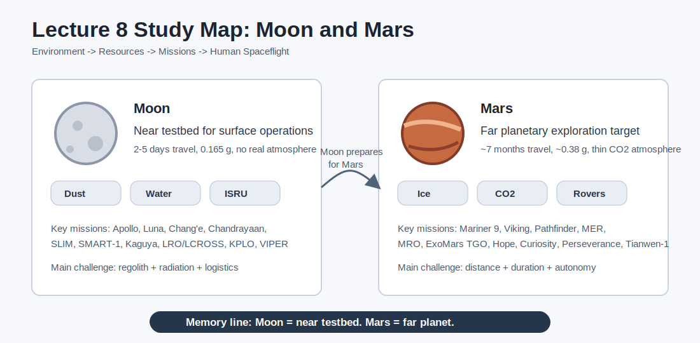

# Study Guide - Lecture 8: Moon and Mars

Source: `HiS-8-MoonMars.pdf`



## 1. Big Picture

This lecture compares the Moon and Mars as destinations for robotic and human exploration.

Remember the whole topic like this:

```text
Environment -> Resources -> Missions -> Human Spaceflight Challenges
     Moon    ->    ISRU   ->  Apollo/Artemis/etc. -> near but harsh
     Mars    ->    ISRU   ->  orbiters/rovers/etc. -> far and harder
```

The central idea:

> The Moon is the nearer testbed for exploration and resource use. Mars is the long-term planetary destination, but it is much more demanding for human spaceflight.

## 2. Lecture Map

| Part | Topic | Main Question |
|---|---|---|
| 1 | Moon characteristics | What is the lunar environment like? |
| 2 | Lunar resources | What can humans use on the Moon? |
| 3 | Lunar missions | How did we learn about lunar materials? |
| 4 | Humans on the Moon | What makes lunar human missions difficult? |
| 5 | Mars characteristics | What is Mars like as a planet? |
| 6 | Martian resources | What resources could support human missions? |
| 7 | Mars missions | What missions have explored Mars? |
| 8 | Humans on Mars | Why is Mars much harder than the Moon? |

Memory sentence:

> **Moon first, Mars later: know the place, find resources, send missions, then send people.**

## 3. The Moon: Main Characteristics

A moon is a **natural satellite orbiting a planet**.

Key Moon facts:

| Feature | Value / Meaning |
|---|---|
| Diameter | about 3,500 km |
| Mass | about 7.342 x 10^22 kg |
| Distance from Earth | perigee about 362,600 km; apogee about 405,400 km |
| Surface gravity | 1.622 m/s^2, about 0.165 g |
| Temperature | about 140-400 K at equator; minimum around 25 K |
| Atmosphere | essentially absent compared with Earth |
| Magnetic field | no global protective magnetosphere |
| Effect on Earth | causes tides |

### Lunar Surface

The Moon has:

- **Highlands**: older, brighter, heavily cratered areas.
- **Maria**: darker basaltic plains formed by ancient volcanic activity.
- **Regolith**: loose surface dust and broken rock produced by impacts and space weathering.

Visual memory:

```text
Highlands = bright + old + cratered
Maria     = dark + basalt + smoother plains
Regolith  = dust + broken rock + operational risk
```

## 4. Lunar Regolith: Why It Matters

Lunar dust is not just "dirt". It is a major design problem.

| Risk | Why It Matters |
|---|---|
| Darkening | Dust on surfaces increases radiative heat transfer. |
| Abrasion | Sharp particles wear down moving parts and surfaces. |
| Seals and optics | Dust damages gaskets, lenses, windows, solar panels and wiring. |
| Human health | Dust may harm lungs, nervous system and cardiovascular system. |
| Spacesuit arcing | Small grains exposed to space may increase electrical risks. |

Memory rule:

> **Dust affects heat, friction, seals, health and electricity.**

## 5. Potential Lunar Resources

Lunar resources matter because they could reduce how much mass must be launched from Earth.

### Resource Map

```text
Lunar Resources
|-- Energy/Fuels: power supply, refueling landers and rockets
|-- Oxygen: life support and propellant
|-- Water: drinking, food production, fuel cells, radiation shielding
|-- Metals: structures, electronics, tools, protection
|-- Construction material: radiation, thermal and micrometeorite protection
```

### Main Lunar Resources and Uses

| Resource | Possible Uses |
|---|---|
| Solar energy | Power generation, especially near polar regions with favorable illumination. |
| Water ice | Life support, fuel/oxygen production, regenerative fuel cells, shielding. |
| Oxygen | Breathing gas, EVA support, oxidizer for rocket fuel. |
| Silicon | Solar cells, computers, microelectronics. |
| Aluminum | Structures, foils, transmission lines. |
| Iron | Civil engineering and manufacturing with other metals. |
| Titanium | Radiation protection, pipes, high-temperature/corrosion-resistant parts. |
| Magnesium | Cameras, power tools, alloying agent. |
| Helium-3 | Potential fusion energy resource; also cooling and neutron detection uses. |
| CO2 | Greenhouse cycles, refrigeration, welding, plastics/polymers. |
| Thorium/Uranium | Nuclear power potential. |
| Gold | Electronics, dentistry, spacesuit visors. |

### Minerals to Recognize

| Mineral | Important Elements |
|---|---|
| Pyroxene | Si, Al, Ca, Na, Fe, Mg and others |
| Olivine | Mg, Fe, Si, O |
| Anorthite | Ca, Al, Si, O |
| Ilmenite | Fe, Ti, O |

### Lunar Water

Water is especially important at the **poles** and in **permanently shadowed regions**.

Possible sources:

- Ice in polar permanently shadowed regions.
- Water molecules across non-shadowed regions, verified by SOFIA in 2020.
- Possible delivery by micrometeorites.
- Hydrogen from solar wind reacting with hydroxyl groups.

## 6. ISRU: The Most Important Resource Concept

**ISRU = In-Situ Resource Utilization**

It means:

> Use local materials instead of bringing everything from Earth.

```text
Regolith + water + sunlight
        -> oxygen
        -> fuel
        -> construction material
        -> radiation shielding
        -> life support consumables
```

Why it matters:

- Reduces launch mass.
- Enables longer missions.
- Supports lunar bases.
- Makes future Mars missions more realistic.

## 7. Lunar Exploration Missions

Lunar missions have focused on four main goals:

| Mission Type | Examples | Purpose |
|---|---|---|
| Landing and sample return | Apollo, Luna, Chang'e, Chandrayaan-3, SLIM | Touch down, collect samples, test landing systems. |
| Orbital science | Luna, SMART-1, SELENE/Kaguya, Chandrayaan-1, LRO/LCROSS, KPLO | Map surface, resources, topography and composition. |
| Human exploration | Apollo, Artemis | Send humans to the lunar surface or lunar orbit. |
| ISRU and commercial use | CLPS, VIPER | Search for resources and test future utilization. |

### Sample Return Milestones

| Mission | Year | Sample Amount |
|---|---:|---:|
| Apollo 11 | 1969 | 22 kg |
| Apollo 12 | 1969 | 34 kg |
| Luna 16 | 1970 | 0.101 kg |
| Apollo 14 | 1971 | 43 kg |
| Apollo 15 | 1971 | 77 kg |
| Luna 20 | 1972 | 0.055 kg |
| Apollo 16 | 1972 | 95 kg |
| Apollo 17 | 1972 | 111 kg |
| Luna 24 | 1976 | 0.17 kg |
| Chang'e 5 | 2020 | 1.731 kg |

Memory note:

> Apollo returned large human-collected samples. Luna and Chang'e show robotic sample return capability.

### Recent / Important Lunar Missions

| Mission | Key Point |
|---|---|
| Chang'e 2-6 | Chinese lunar program: orbiter, landers, rover, sample return, far-side missions. |
| Chandrayaan-1 | Mapped composition and topography; discovered widespread water molecules in lunar soil. |
| Chandrayaan-3 | 2023 landing; demonstrated safe soft landing and rover operations. |
| SLIM | 2024 Japanese mission; demonstrated high-precision lunar landing with a small explorer. |
| SMART-1 | ESA mission using electric propulsion; mapped mineral spectra and elements. |
| SELENE/Kaguya | Japanese orbiter studying lunar origin, evolution and technology. |
| LRO/LCROSS | NASA missions for mapping, reconnaissance and water-related investigations. |
| KPLO | Korean lunar orbiter mapping resources and supporting future landing-site selection. |
| VIPER | Planned rover focused on water ice in permanently shadowed regions. |
| SOFIA | Airborne infrared observatory; helped verify water on sunlit lunar surface. |

## 8. Human Spaceflight on the Moon

Compared with the ISS, the Moon adds major challenges:

| Challenge | Why It Is Hard |
|---|---|
| Distance | Much farther than LEO; emergency return is slower. |
| Radiation | Little atmospheric or magnetic shielding. |
| Dust | Regolith harms equipment and health. |
| Gravity | 0.165 g is useful but still far below Earth gravity. |
| Thermal extremes | Long day/night cycles and extreme cold in shadowed regions. |
| Logistics | Supplies, spare parts and rescue are harder than in LEO. |
| Surface operations | Landing, mobility, habitats and power must work on rough terrain. |

Short version:

> The Moon is close enough to practice, but harsh enough to expose real planetary-surface problems.

## 9. Mars: Main Characteristics

Mars is attractive because it is a planet with:

- A surface humans can land on.
- Polar ice caps.
- A thin atmosphere.
- Evidence of past water activity.
- Geological diversity.
- Potential resources for ISRU.
- Scientific interest for habitability and past life.

Mars also has moons: **Phobos** and **Deimos**.

## 10. Moon vs Mars

| Factor | Moon | Mars |
|---|---|---|
| Distance | about 386,400 km | up to hundreds of millions of km; lecture example: 480,000,000 km |
| Travel time | about 2-5 days | about 7 months |
| Gravity | about 0.165 g | about 0.38 g |
| Atmosphere | essentially none | thin CO2-rich atmosphere |
| Water | polar ice and hydrated materials | polar ice, hydrated minerals, subsurface icy soils |
| Communication delay | small | significant delay |
| Mission complexity | high | very high |
| Best role | testbed and near-term surface destination | long-term planetary exploration destination |

Memory line:

> **Moon = near testbed. Mars = far planet.**

## 11. Potential Martian Resources

### Martian Soil Composition

Important elements in Martian soil include:

| Element | Approx. Concentration |
|---|---:|
| Oxygen | 42.4% |
| Silicon | 21.2% |
| Iron | 15.2% |
| Aluminum | 5.6% |
| Calcium | 4.7% |
| Magnesium | 4.1% |
| Sodium | 2.4% |
| Sulfur | 1.9% |

### Martian Resource Map

```text
Mars Resources
|-- Metals/minerals in soil: Fe, Si, Ni, Li, Cu, Mo, etc.
|-- Water: hydrated minerals, polar ice, subsurface icy soils
|-- Atmosphere: CO2, O2, Ar, N2, CO
|-- Energy: solar energy, but dust and distance reduce reliability
```

### Main Martian Resources and Uses

| Resource | Possible Uses |
|---|---|
| Silicon | Solar cells, computers, microelectronics. |
| Iron | Civil engineering and manufacturing. |
| Copper | Thermal control, cables, electronics. |
| Nickel | Stainless steel, batteries, magnets. |
| Lithium | Batteries, ceramics and glass. |
| Molybdenum | High-performance alloys and aerospace components. |
| Carbon dioxide | Greenhouse cycles, refrigeration, welding, polymers; raw material for ISRU. |
| Oxygen | Life support, EVA and propellant oxidizer. |
| Methane | Rocket fuel, especially relevant for Mars return concepts. |
| Nitrogen | Greenhouse support, food preservation, medical use. |
| Argon | Lasers, welding and low-energy light bulbs. |
| Water | Drinking, plant growth, fuel cells, electrolysis, radiation shielding. |

Key ISRU idea for Mars:

```text
Martian CO2 + hydrogen/water processing
        -> oxygen and methane concepts
        -> fuel for return missions
        -> lower Earth-launch mass
```

## 12. Mars Exploration Missions

Mars missions have focused on:

- Early flybys and landings.
- Orbital science and climate mapping.
- Rover and surface exploration.
- Sample return planning.
- Future human exploration and infrastructure.

### Mission Timeline to Remember

| Mission | Key Point |
|---|---|
| Mariner 9 | First Mars orbiter, 1971. |
| Mars 3 | First soft landing, 1971. |
| Viking 1 | First successful lander, 1975. |
| Mars Global Surveyor | Long-duration orbiter launched in 1996. |
| Mars Pathfinder / Sojourner | First rover to operate on Mars, launched 1996. |
| Mars Reconnaissance Orbiter | Since 2006; climate, water-related landforms, landing-site support, data relay. |
| ExoMars Trace Gas Orbiter | Methane detection, hydrogen mapping, relay support. |
| Hope | UAE mission studying climate, weather and atmospheric escape. |
| Spirit and Opportunity | MER rovers searching for evidence of past water activity. |
| Curiosity | Gale crater and Mount Sharp; habitability, water, climate and geology. |
| Perseverance | Ancient habitability, biosignatures, sample caching and ISRU demonstration. |
| Tianwen-1 | Chinese orbiter/lander/rover mission studying geology, soil, ice, atmosphere and magnetic field. |
| Ingenuity | Demonstrated powered flight in Mars' thin atmosphere. |

### Key Instruments / Concepts

| Mission | Instruments / Focus |
|---|---|
| Mars Global Surveyor | Camera, laser altimeter, thermal spectrometer, magnetometer, relay. |
| MRO | Climate, atmosphere, subsurface layers, water/ice evidence, landing-site selection. |
| ExoMars TGO | Methane detection, hydrogen mapping, communication relay. |
| Mars Pathfinder | Sojourner rover, imaging, meteorology, APXS. |
| MER Spirit/Opportunity | Panoramic camera, microscopic imager, thermal spectrometer, APXS, rock abrasion tool. |
| Curiosity | Organic carbon, life building blocks, geology, climate, radiation. |
| Perseverance | MOXIE, PIXL, RIMFAX, MEDA, SHERLOC. |

## 13. Human Spaceflight on Mars

Mars is much harder than the Moon for crewed missions.

### Moon Capsule vs Mars Vehicle Example

| Item | Orion / Moon Example | Starship / Mars Example |
|---|---|---|
| Dry mass | about 9,300 kg | very large; lecture notes around 2,000 t class |
| Crew | 2-6 | up to 100 in concept |
| Payload | about 100 kg | around 20 t in concept |
| Travel time | 2-5 days | about 7 months |
| Distance | about 386,400 km | about 480,000,000 km in lecture example |
| Main implication | small, lightweight capsules can work | super-heavy launch systems and large infrastructure are needed |

### Main Human Mars Challenges

| Challenge | Why It Matters |
|---|---|
| Duration | Long travel time increases risk, radiation dose and logistics demand. |
| Distance | No quick rescue or fast return. |
| Communication delay | Crew must operate more autonomously. |
| Entry, descent and landing | Landing heavy payloads on Mars is difficult because atmosphere is thin but still significant. |
| Radiation | Deep-space cruise and Martian surface need protection. |
| Dust | Dust storms and fine particles affect power, mechanisms and health. |
| ISRU reliability | Return fuel and life support may depend on local production. |
| Psychology | Isolation and confinement are far more severe than for lunar missions. |

Short version:

> Moon missions are difficult. Mars missions are difficult plus long, remote and infrastructure-heavy.

## 14. What You Must Know for the Exam

Use this checklist:

- Explain the Moon's environment: gravity, temperature, regolith, atmosphere and magnetosphere.
- Explain why lunar regolith is dangerous.
- List key lunar resources and their uses: water, oxygen, metals, solar energy, gases.
- Define ISRU and explain why it matters.
- Name key lunar missions: Apollo, Luna, Chang'e, Chandrayaan, SLIM, SMART-1, Kaguya, LRO/LCROSS, KPLO, VIPER, SOFIA.
- Compare ISS/LEO operations with lunar surface operations.
- Explain Mars as an exploration target: water history, ice, thin atmosphere, resources and habitability.
- List key Martian resources: water, CO2, oxygen, methane, metals and rare materials.
- Name key Mars missions: Mariner 9, Mars 3, Viking, Pathfinder, MER, MRO, ExoMars TGO, Hope, Curiosity, Perseverance, Tianwen-1, Ingenuity.
- Explain why human Mars missions are harder than Moon missions.

## 15. Fast Memory Tables

### Moon in 5 Words

```text
Near - dusty - airless - resource-rich - testbed
```

### Mars in 5 Words

```text
Far - cold - dusty - icy - autonomous
```

### Resources by Destination

| Resource | Moon | Mars |
|---|---|---|
| Water | Polar ice, shadowed regions, hydrated surface molecules | Polar ice, hydrated minerals, subsurface icy soils |
| Oxygen | Regolith/water processing, life support, fuel | Atmosphere/water processing, life support, fuel |
| Metals | Al, Si, Fe, Ti, Mg | Fe, Si, Ni, Li, Cu, Mo and others |
| Energy | Solar, especially polar illumination | Solar, but reduced by distance and dust |
| Atmosphere gases | Almost none | CO2, Ar, N2, CO, trace O2 |

### Mission Types

```text
Orbiters  -> map and measure from above
Landers   -> survive and measure at one site
Rovers    -> move and investigate surface diversity
Sample return -> bring material to Earth labs
Human missions -> combine science, operations and infrastructure
```

## 16. Flashcards

**What is the Moon's gravity?**  
About 1.622 m/s^2, or about 0.165 g.

**Why is lunar dust dangerous?**  
It darkens surfaces, abrades mechanisms, damages seals/optics, harms health and may increase electrical risks.

**What is ISRU?**  
In-Situ Resource Utilization: using local materials instead of bringing everything from Earth.

**Why is water important on the Moon and Mars?**  
It supports drinking, plant growth, oxygen/fuel production, regenerative fuel cells and radiation shielding.

**Where is lunar water especially important?**  
At the poles and in permanently shadowed regions.

**Which missions returned lunar samples?**  
Apollo, Luna and Chang'e missions.

**What did Chandrayaan-1 discover?**  
Widespread water molecules in lunar soil.

**What is the main difference between Moon and Mars travel time?**  
Moon: days. Mars: months.

**Why is Mars attractive for exploration?**  
It has ice, a surface, a thin atmosphere, evidence of past water and potential habitability clues.

**Which Mars mission demonstrated powered flight?**  
Ingenuity.

**Which Mars mission demonstrated oxygen ISRU?**  
Perseverance carried MOXIE.

**Why are human Mars missions harder than lunar missions?**  
They are longer, farther away, harder to resupply, more autonomous and require much larger infrastructure.

## 17. The Whole Lecture in 10 Sentences

1. The Moon is Earth's natural satellite and the closest realistic surface destination for human exploration.
2. Its low gravity, extreme temperatures, lack of atmosphere and dangerous regolith make it operationally difficult.
3. Lunar resources include water, oxygen, metals, solar energy, construction materials and valuable gases.
4. ISRU is the key idea: use local resources to reduce dependence on Earth.
5. Lunar missions have progressed from orbiters and sample return to precision landing, resource mapping and future commercial use.
6. Mars is farther away but scientifically attractive because of its geology, ice, atmosphere and possible habitability history.
7. Martian resources include water, CO2, oxygen, methane-related fuel concepts, metals and useful atmospheric gases.
8. Mars exploration has used orbiters, landers, rovers, helicopters and future sample-return planning.
9. Human Mars missions are much harder than lunar missions because of distance, duration, radiation, autonomy and infrastructure needs.
10. The Moon is the practice ground; Mars is the long-term planetary challenge.
