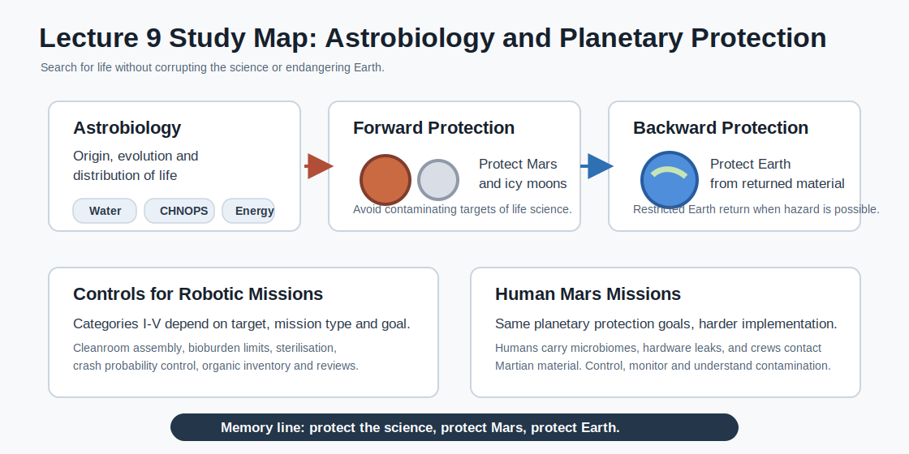

# Study Guide - Lecture 9: Planetary Protection, Astrobiology and the Search for Extraterrestrial Life

Source: `HiS-09-Rettberg-2026-05-04-f.pdf`



## 1. Big Picture

This lecture explains why the search for extraterrestrial life needs **planetary protection**.

The core idea:

> We want to search for life without contaminating other worlds, corrupting the science, or bringing a possible biological hazard back to Earth.

Memory line:

```text
Astrobiology asks: is there life?
Planetary protection asks: can we search safely and cleanly?
```

## 2. Lecture Map

| Block | Topic | Main Question |
|---|---|---|
| 1 | Astrobiology | What is life and where could it exist? |
| 2 | Habitability | Which environments could support life? |
| 3 | Mars and icy moons | Where should we search? |
| 4 | Biosignatures | How can we identify signs of life correctly? |
| 5 | Planetary protection | How do we avoid contamination? |
| 6 | Requirements | What do missions have to do? |
| 7 | Cleanrooms and bioburden | How is contamination measured and controlled? |
| 8 | Human Mars missions | Why do humans make planetary protection harder? |

## 3. Astrobiology

**Astrobiology** is the study of the **origin, evolution and distribution of life in the universe**.

Main questions:

- How and when did life on Earth begin?
- What were early Earth conditions like?
- Are there other habitable environments in the Solar System or beyond?
- Are those environments inhabited?
- Is life rare, or is it a general principle when conditions are right?

Astrobiology is multidisciplinary:

```text
biology + chemistry + geology + planetary science + space engineering
```

## 4. Life and Habitability

### Requirements for Life as We Know It

| Requirement | Meaning |
|---|---|
| Liquid water | Solvent for biochemical reactions. |
| Chemical elements | CHNOPS: carbon, hydrogen, nitrogen, oxygen, phosphorus, sulfur, plus others. |
| Energy source | Chemical energy or light. |

Memory rule:

> **Water + CHNOPS + energy = basic life checklist.**

### Habitability

**Habitability** is the potential of a planet or moon to develop and maintain environments hospitable to life.

Important distinction:

> A place can be habitable even if it does not actually contain life.

Why this is hard:

- Earth is the only confirmed example of life.
- Early Earth, about 3.4 billion years ago, was very different from Earth today.
- We use Earth as the reference, but that may limit how we think about life elsewhere.

## 5. Places of Astrobiological Interest

The lecture highlights worlds where we search for:

- Prebiotic chemistry.
- Past or present signs of life.
- Habitable environments.

Key examples:

| World | Why It Matters |
|---|---|
| Earth | Only known inhabited planet; reference case. |
| Mars | Past water, possible subsurface water/ice, possible ancient habitability. |
| Europa | Icy moon with potential subsurface ocean. |
| Enceladus | Icy moon with ocean-related interest and plume activity. |
| Titan | Organic chemistry and astrobiological interest. |

## 6. Present Mars: Why It Is Hard for Life

Mars is scientifically interesting, but the present surface is hostile.

| Factor | Effect |
|---|---|
| Solar UV radiation | No ozone layer provides surface shielding. |
| Cosmic ionizing radiation | No global magnetic field protects the surface. |
| Anoxic conditions | No oxygen-rich atmosphere like Earth. |
| Low pressure | About 7-10 hPa; promotes desiccation. |
| Low temperature | Average around -65 deg C. |
| Dry surface | Liquid water is unstable at the surface. |

Mars may still have:

- Water ice at the poles.
- Frozen water in the subsurface.
- Temporary brines on the surface.
- Possible liquid water in the subsurface.

Key question:

> Is there extinct or extant Martian life?

## 7. Missions Searching for Life and Habitability

### Mars Sample Return and Mars Missions

| Mission / Program | Relevance |
|---|---|
| Perseverance | Collects and caches Martian samples; investigates ancient habitability and biosignatures. |
| NASA-ESA Mars Sample Return | Planned architecture to return samples collected on Mars. |
| ExoMars Trace Gas Orbiter | Studies trace gases such as methane and supports future missions. |
| ExoMars Rosalind Franklin rover | ESA rover mission planned for future launch; focused on Mars life-related science. |
| JAXA MMX | Martian Moons eXploration; sample return from Phobos, investigation of Phobos and Deimos. |
| CNSA Tianwen-3 | Planned Chinese Mars sample return mission. |

### Icy Moon Missions

| Mission | Target / Goal |
|---|---|
| JUICE | ESA mission to Jupiter and icy moons Ganymede, Callisto and Europa. |
| Europa Clipper | NASA mission with nearly 50 flybys of Europa; determines whether places below Europa's surface could support life. |

Memory line:

> Mars asks about past and possibly present life. Icy moons ask about ocean habitability.

## 8. Biosignatures and the Problem of False Results

A **biosignature** is a substance, structure or pattern that may indicate biological activity.

A **potential biosignature** is not proof. It needs more data before concluding life is present or absent.

### Four Possible Measurement Outcomes

| Reality / Measurement | Negative Result | Positive Result |
|---|---|---|
| No signs of life in sample | True negative | False positive |
| Signs of life in sample | False negative | True positive |

Why mistakes happen:

- **False positive**: contamination or non-biological chemistry looks like life.
- **False negative**: wrong method, low sensitivity or poorly chosen measurement misses life.

Planetary protection is essential because contamination can create false positives and destroy scientific credibility.

## 9. Planetary Protection

Planetary protection has two directions:

```text
Forward protection  = protect other worlds from Earth contamination.
Backward protection = protect Earth from returned extraterrestrial material.
```

| Direction | Protects | Example Concern |
|---|---|---|
| Forward planetary protection | Mars, Europa, Enceladus and other targets | Earth microbes contaminating a life-detection site. |
| Backward planetary protection | Earth and its biosphere | Returned samples containing unknown hazards. |

Short version:

> Protect the science. Protect other worlds. Protect Earth.

## 10. Legal and Policy Framework

The legal basis is **Article IX of the Outer Space Treaty, 1967**.

Key institution:

- **COSPAR**: Committee on Space Research.
- COSPAR maintains the **Policy on Planetary Protection**.
- It is an international, voluntary and non-legally binding standard used to guide compliance with the Outer Space Treaty.

Important:

> Planetary protection requirements evolve as science and mission plans change.

## 11. What Planetary Protection Is Not

Do not confuse planetary protection with:

| Not Planetary Protection | Covered By |
|---|---|
| Asteroid defense | Near Earth Objects and Space Situational Awareness programs. |
| Space debris | Space Surveillance and Tracking, debris and sustainability programs. |
| Cultural or natural heritage | UNESCO on Earth; other exploration/heritage discussions for space. |

Memory rule:

> Planetary protection is about biological and organic contamination, not asteroid impacts or orbital debris.

## 12. Planetary Protection Categories

COSPAR uses **five planetary protection categories**. They depend on:

- Target body.
- Mission type: flyby, orbiter, lander, sample return.
- Mission goal: for example, whether Mars life-detection experiments are included.
- Scientific interest and contamination risk.

Study version:

| Category | Typical Meaning |
|---|---|
| I | Very low interest for life/prebiotic chemistry; minimal requirements. |
| II | Some interest, but low contamination risk; documentation mainly. |
| III | Flyby/orbiter missions to bodies of interest, such as Mars orbiters. |
| IV | Lander/probe missions to bodies of interest, such as Mars landers. |
| V | Earth-return missions; can be unrestricted or restricted depending on hazard potential. |

Lecture examples:

- **Category III orbiters**, e.g. Mars orbiters.
- **Category IV landers**, e.g. Mars landers.
- **Category V restricted Earth return**, for pristine samples from uncharacterized or special regions.

## 13. Organic Contamination Control

Organic contamination means:

> Any terrestrial organic matter that could be mistaken for, overwhelm, or mask an extraterrestrial organic signature.

Why it matters:

- Life-detection missions look for small chemical traces.
- Earth organics can look like a biosignature.
- Even non-living contamination can compromise results.

The lecture notes that specific organic contamination requirements are still developing, but COSPAR recommends an **organic inventory**.

## 14. Typical Requirements for Robotic Missions

### Category III Orbiters, e.g. Mars Orbiters

Typical requirements include:

- Cleanroom assembly, ISO class 8 or better.
- Limitation on crash probability, or bioburden reduction.
- Localization of eventual crash impact.
- Inventory of organic materials.

### Category IV Landers, e.g. Mars Landers

Typical requirements include Category III measures plus:

- Bioburden reduction or active sterilization.
- Microbiological controls.
- Cleanroom assembly with biocleanliness controls.
- Lander recontamination prevention, such as bioshields and HEPA filters.

### Quantitative Bioburden Example for Mars Landers

| Category | Maximum Bioburden Mentioned |
|---|---|
| IVa | <= 300 bacterial spores/m2 and <= 3.0 x 10^5 spores on the entire spacecraft/lander. |
| IVb / IVc | < 30 bacterial spores on exposed surface. |

The standard assay counts aerobic microorganisms that survive heat shock at **80 deg C for 15 minutes** and are cultured for **72 hours**.

## 15. Standards and Implementation

For ESA missions, ECSS standards are used.

Important ECSS examples:

| Standard | Topic |
|---|---|
| ECSS-Q-U-ST-20C | Planetary Protection. |
| ECSS-Q-ST-70-55C | Microbial examination of flight hardware and cleanrooms. |
| ECSS-Q-ST-70-58C | Bioburden control of cleanrooms. |
| ECSS-Q-ST-70-53C | Materials and hardware compatibility for sterilization. |
| ECSS-Q-ST-70-57C | Dry heat bioburden reduction. |
| ECSS-Q-ST-70-56C | Vapour phase bioburden reduction. |

Planetary protection affects:

- Mission design.
- Spacecraft hardware and payload.
- Material selection.
- Assembly, integration and testing.
- Sterilization strategies.
- Documentation, reviews and management structures.

## 16. Bioburden and Cleanroom Sampling

**Bioburden** = quantity of viable microorganisms measured with a specified assay.  
Question: **How many microbes are there?**

**Biodiversity** = identification of microorganism species using specified assays.  
Question: **Which microbes are there?**

Sampling methods:

| Method | Typical Use |
|---|---|
| Swabs | Surface sampling up to about 25 cm2. |
| Wipes | Larger surface sampling up to about 1 m2. |
| Air samplers | Biological contaminants in cleanroom air. |
| DNA analysis | Biodiversity and species identification. |
| Cultivation | Viable bioburden determination. |

Example from ExoMars:

- ExoMars 2016 required thousands of assays.
- DLR, MedUni Graz and TAS-I monitored cleanroom and spacecraft microbiology.
- ExoMars Rosalind Franklin continues similar planetary protection work.

## 17. Icy Worlds: Probabilistic Planetary Protection

For icy moons such as Europa and Enceladus, the approach is probabilistic.

The key question:

> What is the probability that Earth organisms reach a subsurface ocean and multiply there?

Factors to consider:

- Bioburden at launch.
- Survival during cruise.
- Survival in radiation near Europa or Enceladus.
- Probability of landing or impact.
- Transport mechanisms and timescales to subsurface liquid water.
- Survival and proliferation before, during and after transfer.

Relevant organisms are those that could:

- Survive desiccation.
- Survive radiation.
- Replicate at low temperature.
- Live under oligotrophic, anaerobic and salty conditions.

Memory line:

> For icy moons, the real risk is not just arrival; it is arrival plus survival plus transfer to ocean plus growth.

## 18. New Methods and Ongoing Work

Planetary protection is moving beyond only cultivation-based assays.

Ongoing activities include:

- Molecular methods to complement standard cultivation.
- Metagenomics for bioburden and biodiversity analysis.
- Identification of viable organisms in cleanrooms and on spacecraft.
- Inputs into probabilistic risk assessment models.

Why this matters:

> Some relevant microbes may be hard or slow to cultivate, so DNA-based and metagenomic methods can improve risk assessment.

## 19. Human Missions to Mars

COSPAR's principle:

> Planetary protection goals should not be relaxed for human missions to Mars.

But implementation is harder because humans are biological systems.

### The Human Microbiome

Humans carry many microorganisms:

- Many bacteria and archaea live in and on the body.
- The microbiome has far more genes than the human genome.
- Around 5,000 species may be involved.
- Most microbes are essential; some can cause harm.
- Humans shed and excrete large amounts of microbial material.

### Why Human Mars Missions Are Difficult for Planetary Protection

| Problem | Why It Matters |
|---|---|
| Hardware leaks | Airlocks, suits and pressurized rovers cannot be perfectly closed systems. |
| Temperate habitats | Human habitats create Earth-like environments where microbes can persist. |
| Crew microbiome | Humans continuously release microorganisms. |
| Contact with Martian material | Crew members will inevitably interact with Martian dust, rock and samples. |
| Sample return | Returned material may need restricted Earth-return handling. |

Planetary protection for human Mars missions must balance:

```text
Protect Earth + Protect Mars + Ensure crew health
```

## 20. Knowledge Gaps for Human Mars Missions

The lecture highlights three major knowledge-gap areas:

| Knowledge Gap | Meaning |
|---|---|
| Natural transport of biological contamination on Mars | How microbes or biomolecules move through dust, wind, water/ice or human activity. |
| Technology and operations for contamination control | How suits, airlocks, habitats, rovers and tools can limit contamination. |
| Microbial and human health monitoring | How to track crew microbes, health risks and environmental release. |

## 21. Special Regions on Mars

A **Special Region** is a region where:

- Terrestrial organisms are likely to replicate, or
- There is high potential for extant Martian life.

Important rule:

> Robotic systems and human activities should not contaminate Special Regions on Mars.

Environmental thresholds for possible terrestrial microbial replication must be satisfied at the same time:

| Parameter | Lower Limit |
|---|---|
| Water activity | 0.5, including margin |
| Temperature | -28 deg C, including margin |

Before planning human missions, Special Regions must be identified and considered.

## 22. What You Must Know for the Exam

Use this checklist:

- Define astrobiology.
- Explain the requirements for life as we know it: liquid water, CHNOPS and energy.
- Define habitability and explain why habitability does not prove life.
- Explain why Mars is hostile today but still astrobiologically interesting.
- Explain what a biosignature and potential biosignature are.
- Distinguish true positive, false positive, true negative and false negative.
- Define forward and backward planetary protection.
- Know the legal basis: Article IX of the Outer Space Treaty.
- Know COSPAR's role in planetary protection policy.
- Explain what planetary protection is not: asteroid defense, space debris or heritage protection.
- Understand categories I-V and why Mars landers and orbiters have different requirements.
- Explain bioburden, biodiversity, swabs, wipes, cleanrooms and sterilization.
- Explain why icy worlds need a probabilistic contamination approach.
- Explain why human Mars missions make planetary protection much more difficult.
- Know what Special Regions on Mars are.

## 23. Fast Memory Tables

### Planetary Protection in 5 Words

```text
Science - Mars - Earth - microbes - control
```

### The Three Protections

| Protection Goal | Meaning |
|---|---|
| Protect science | Avoid false biosignatures and preserve future investigations. |
| Protect other worlds | Avoid forward contamination of Mars and icy moons. |
| Protect Earth | Avoid backward contamination from returned samples. |

### Most Important Acronyms

| Acronym | Meaning |
|---|---|
| COSPAR | Committee on Space Research. |
| PP / PPP | Planetary Protection / Planetary Protection Policy. |
| OST | Outer Space Treaty. |
| ECSS | European Cooperation for Space Standardization. |
| CHNOPS | Carbon, hydrogen, nitrogen, oxygen, phosphorus, sulfur. |
| MSR | Mars Sample Return. |
| MMX | Martian Moons eXploration. |

## 24. Flashcards

**What is astrobiology?**  
The study of the origin, evolution and distribution of life in the universe.

**What are the basic requirements for life as we know it?**  
Liquid water, CHNOPS chemical elements and an energy source.

**Does habitability mean life is present?**  
No. It means the environment could support life.

**Why is present Mars hostile?**  
UV radiation, cosmic radiation, no ozone layer, no global magnetic field, low pressure, cold temperatures and desiccation.

**What is a biosignature?**  
A substance, structure or pattern that may indicate biological activity.

**What is a potential biosignature?**  
A possible sign of life that needs more data before reaching a conclusion.

**What is forward planetary protection?**  
Protecting other worlds from Earth contamination.

**What is backward planetary protection?**  
Protecting Earth from possible hazards in returned extraterrestrial material.

**What is the legal basis of planetary protection?**  
Article IX of the Outer Space Treaty, 1967.

**What does COSPAR do?**  
Maintains planetary protection policy and requirements used as international guidance.

**What is bioburden?**  
The quantity of viable microorganisms measured with a specified assay.

**What is biodiversity in this context?**  
The identification of microorganism species present in a sample.

**Why are humans hard for planetary protection?**  
Humans carry microbiomes, habitats leak, suits and rovers are not perfectly closed, and crews contact Martian material.

**What is a Special Region on Mars?**  
A region where terrestrial organisms may replicate or where extant Martian life may exist.

## 25. The Whole Lecture in 10 Sentences

1. Astrobiology studies the origin, evolution and distribution of life in the universe.
2. Life as we know it needs liquid water, CHNOPS elements and energy.
3. A habitable environment does not necessarily contain life.
4. Mars and icy moons are major astrobiological targets because of water, ice, oceans or past habitability.
5. Biosignature detection is difficult because contamination can create false positives and weak methods can create false negatives.
6. Planetary protection exists to protect science, other worlds and Earth.
7. Forward protection prevents Earth contamination of other planets and moons.
8. Backward protection protects Earth from returned extraterrestrial material.
9. COSPAR categories and requirements depend on target body, mission type and mission goal.
10. Human Mars missions make planetary protection much harder because humans continuously carry and release microorganisms.
