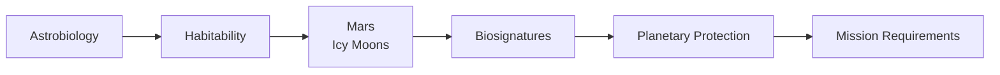
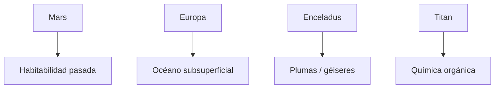
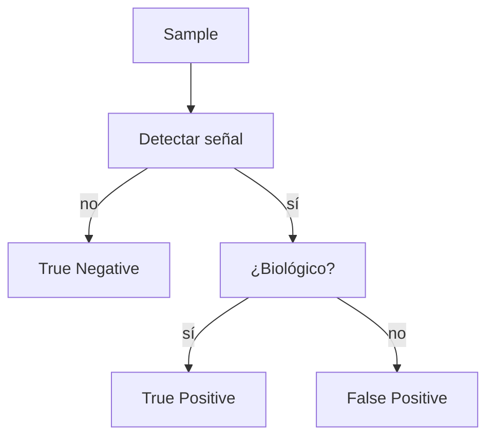
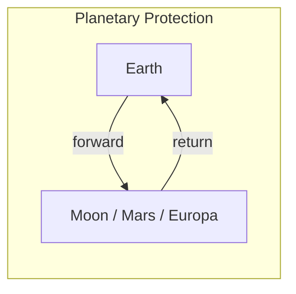
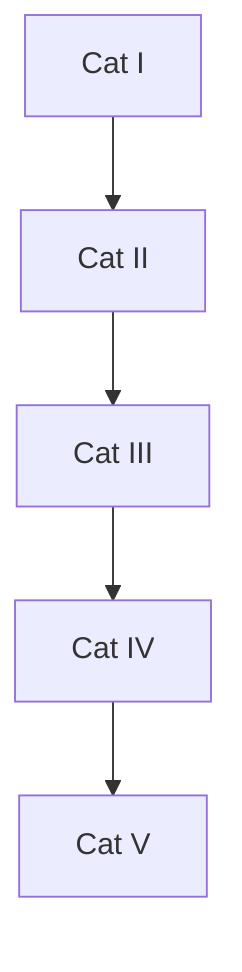

# Study Guide (Paginado Visual) - Lecture 9: Planetary Protection, Astrobiology

> Versión adaptada para memoria fotográfica: páginas virtuales, diagramas y fotos sugeridas.

<!-- Page 1 -->

Page 1

## 1. Big Picture (visual)

Planetary protection permite que busquemos vida en otros mundos manteniendo la integridad científica y la seguridad de la Tierra. Esto implica reglas operativas y técnicas para reducir la contaminación biológica y orgánica desde la fabricación, lanzamiento, operaciones y retorno de muestras.

<strong>Memory line:</strong> Astrobiology = ¿hay vida? · Planetary protection = ¿podemos buscarla sin dañar la ciencia?

Consejo de memoria: asocia esta portada con una sala de control — la imagen grande actúa como ancla visual para las páginas siguientes.

<!-- Page 2 -->

Page 2

## 2. Lecture Map & Key Questions

Los temas principales se organizan en bloques: (1) Astrobiología, (2) Habitabilidad, (3) Marte e lunas heladas, (4) Biosignatures, (5) Planetary protection, (6) Requisitos de misión, (7) Cleanrooms y bioburden, (8) Misiones tripuladas.

Cada bloque responde a una pregunta clave: por ejemplo, "¿Dónde buscar vida?" o "¿Cómo evitar que la Tierra contamine esos sitios?". Mantén estas preguntas cerca de cada página para recordarlas.

<!-- Page 3 -->

Page 3

## 3. ¿Qué necesita la vida? (puntos clave)

La biología basada en la Tierra requiere tres condiciones básicas: un solvente líquido (agua), los elementos químicos esenciales (CHNOPS) y una fuente de energía (luz o química). Estas condiciones no garantizan vida, pero son la "lista de comprobación" inicial.

- Agua líquida: medio para reacciones bioquímicas.
- CHNOPS: carbono, hidrógeno, nitrógeno, oxígeno, fósforo, azufre.
- Energía: gradientes químicos o energía luminosa.

Pista mnemotécnica: imagina un gotero de agua sobre las letras CHNOPS iluminadas por un sol — eso es la ecuación básica para recordar.

<!-- Page 4 -->

Page 4

## 4. Mundos de interés (resumen visual)

- Marte: sedimentos y minerales que apuntan a agua antigua; hielo superficial y posible agua subterránea.
- Europa: corteza helada con océano subsuperficial; intercambio de material por fracturas.
- Enceladus: géiseres y plumas que expulsan material del océano subterráneo.
- Titan: atmósfera rica en orgánicos y lagos de hidrocarburos; química pre-biótica.

Asocia cada mundo a un icono: Mars = roca rojiza; Europa = grieta en hielo; Enceladus = columna de vapor; Titan = lagos oscuros.

<!-- Page 5 -->

Page 5

## 5. Biosignatures y errores comunes

Un biosignature es cualquier señal (molécula, patrón, estructura) que podría indicar actividad biológica. Pero los resultados pueden ser engañosos: existe la posibilidad de falsos positivos (química abiótica que imita vida) y falsos negativos (vida presente pero no detectada).

- True positive: señal biológica real detectada.
- False positive: señal no biológica parece biológica.
- True negative: no hay señal y realmente no hay vida.
- False negative: vida existe pero la prueba falla.

Memoria: piénsalo como un detector de humo que a veces salta por vapor (FP) o no detecta un fuego lento (FN).

<!-- Page 6 -->

Page 6

## 6. Planetary protection: forward y backward

- Forward protection: acciones para impedir que microorganismos terrestres contaminen objetivos de búsqueda de vida (p. ej. Marte, Europa).
- Backward protection: medidas para proteger la biosfera terrestre frente a muestras devueltas desde el espacio.

Ambas direcciones requieren evaluación de riesgo, controles de bioburden, planificación operativa y a menudo medidas legales/políticas.

<!-- Page 7 -->

Page 7

## 7. Categorías COSPAR (resumen práctico)

COSPAR clasifica misiones según riesgo y tipo de misión:
- Categoría I: cuerpos sin interés astrobiológico.
- Categoría II: interés limitado, documentación.
- Categoría III: orbitadores a cuerpos de interés.
- Categoría IV: aterrizadores/penetradores.
- Categoría V: retorno de muestras (restringido o no restringido).

Recuerda: a mayor categoría, más estrictos los requisitos de limpieza y documentación.

<!-- Page 8 -->

Page 8

## 8. Bioburden y métodos de muestreo

Bioburden = número de microorganismos viables detectables con ensayos específicos. Se usa cultivo tras choque térmico (ej. 80 °C por 15 min) y cultivo 72 h para estimar esporas.

Métodos:
- Swabs y wipes: superficies pequeñas y grandes.
- Air samplers: muestreo de aire en cleanrooms.
- Análisis molecular y metagenómica: para biodiversidad y detección de organismos no cultivables.
- Cultivo: determina viabilidad.

Tip: asocia "placas Petri" con la idea de contar esporas — imagen fácil de reconocer.

<!-- Page 9 -->

Page 9

## 9. Misiones humanas y desafíos

Las misiones tripuladas añaden complejidad: las personas llevan microbiomas ricos que se liberan continuamente. Los hábitats crean ambientes que favorecen microbios, además de riesgos por fugas y contacto directo con el entorno planetario.

Puntos clave:
- Control de la microbiota de la tripulación (monitorización constante).
- Diseño de ropas, airlocks y procedimientos para minimizar liberación de material biológico.
- Planificación para muestras y operaciones que eviten Special Regions.

<!-- Page 10: Checklist y flashcards -->

Page 10

## 10. Checklist de examen y tarjetas rápidas

- Define astrobiología y los requisitos de la vida (agua, CHNOPS, energía).
- Explica diferencia entre habitabilidad y presencia de vida.
- Define biosignature y potential biosignature; distingue TP/FP/TN/FN.
- Define forward/backward planetary protection; conoce Art. IX del OST y el rol de COSPAR.
- Describe categorías I–V y ejemplos (orbiter/lander/sample return).
- Describe bioburden y métodos principales (swabs, wipes, air samplers, cultivo, metagenómica).

**Flashcards rápidas**
- Q: ¿Qué es bioburden? A: Cantidad de microorganismos viables medida con un ensayo definido.
- Q: ¿Qué es una Special Region? A: Área donde la replicación de microorganismos terrestres o la existencia de vida marciana es posible; requiere especial cuidado.

Consejo: repasa una "página" por sesión corta de 5-8 minutos para aprovechar la memoria fotográfica.

---

## Imágenes a generar / extraer (actualizado)

- `assets/collage_worlds_placeholder.jpg`: Collage con Mars, Europa, Enceladus y Titan en estilo educativo. Prompt: "educational collage: Mars (rocky red), Europa (cracked ice), Enceladus (plume), Titan (dark hydrocarbon lakes), high contrast, simple icons".

- `assets/forward_backward_placeholder.png`: Diagrama explicativo con dos flechas grandes y colores diferenciados (verde para forward, rojo para backward). Incluir etiquetas y pequeño texto explicativo.

- `assets/cleanroom_sampling_placeholder.jpg`: Foto o ilustración de técnico en cleanroom muestreando hardware con hisopo y placas Petri.

- `assets/habitat_leak_placeholder.jpg`: Ilustración del interior/exterior de un hábitat marciano mostrando fugas y rutas de dispersión microbiana.

- `assets/icon_water_chnops_energy.png`: Conjunto de iconos estilo flat: droplet, "CHNOPS" y sol/relámpago.

Nota: hay una imagen útil ya disponible: `assets/his09_planetary_protection_overview.svg`.

## Próximos pasos disponibles

- Extraer figuras del PDF `HiS-09-Rettberg-2026-05-04-f.pdf` y añadirlas a `assets/`.
- Generar imágenes con prompts detallados (preparo prompts listos para un servicio de imágenes).
- Exportar este Markdown a un PDF paginado para impresión.

