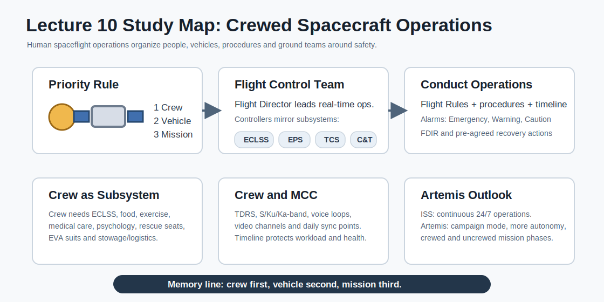

# Study Guide - Lecture 10: Human Spaceflight Operations

Source: `HiS-10-Crewed SpacecraftOperations.pdf`



## 1. Big Picture

This lecture explains how crewed spacecraft operations are organized, using the ISS and the Columbus Control Center as the main operational model.

The core idea:

> Human spaceflight operations are not only about flying hardware. They are about keeping the crew safe while operating a complex vehicle, coordinating ground teams and achieving the mission.

The key priority rule:

```text
1. Crew
2. Vehicle
3. Mission
```

Memory line:

> If there is a conflict, protect the crew first, then the spacecraft, then the science or mission objective.

## 2. Lecture Map

| Block | Topic | Main Question |
|---|---|---|
| 1 | Introduction | Why use ISS operations as a model? |
| 2 | Crew as subsystem | How does the presence of humans change spacecraft operations? |
| 3 | Flight Control Team | Who controls and supports the mission from the ground? |
| 4 | Conducting operations | How are procedures, rules and off-nominal cases handled? |
| 5 | Crew and Mission Control | How do crew and ground communicate and plan work? |
| 6 | Artemis outlook | How will lunar operations differ from ISS operations? |

## 3. ISS as the Operations Model

There is no single universal concept of human spaceflight operations, but ISS operations provide a strong model because they combine:

- Continuous human presence.
- International coordination.
- Complex vehicle systems.
- Science operations.
- Visiting vehicles.
- EVA and maintenance.
- Real-time mission control.

Important ISS facts from the lecture:

| Feature | Key Point |
|---|---|
| Size | About the size of a soccer field. |
| Mass | More than 400 tonnes. |
| Construction start | 1998. |
| Human presence | More than 25 years of continuous human presence. |
| Visiting spacecraft | More than 100 visits. |
| EVA time | More than 1000 hours of extravehicular activity. |
| Current plan | ISS decommissioning planned for 2032. |

## 4. Columbus Module

The **Columbus Module** is ESA's habitable laboratory module on the ISS.

Key facts:

- Launched on 7 February 2008 during Space Shuttle mission STS-122/1E.
- Designed as a non-standalone laboratory.
- Today it also provides a sleeping quarter and exercise device.
- Critical resources come from the ISS: power, cooling, atmosphere and attitude control.

Memory rule:

> Columbus is a laboratory, but it depends on the ISS to survive.

## 5. The Crew: Just Another Subsystem?

The lecture uses the idea of the crew as a subsystem to show how humans change operations.

### Normal Spacecraft Subsystems

| Subsystem | Function |
|---|---|
| TCS | Thermal Control System. |
| EPDS / EPS | Electrical Power Distribution/System. |
| DMS / C&DH | Data management / command and data handling. |
| COMMS / C&T | Communication and tracking. |
| MCS / GNC | Motion, attitude, guidance and control. |
| Payload | Cameras, experiments, antennas, telescopes and science hardware. |

### What Changes Because Humans Are On Board?

| System Area | Human-Spaceflight Adaptation |
|---|---|
| Thermal control | Air temperature, humidity and metabolic heat must be controlled. |
| Power | Lights, private devices and oxygen-rich environments create fire-risk concerns. |
| Data and communications | Crew can command and monitor systems through laptops; voice and video channels are needed. |
| Motion control | Attitude, thrusters, gyros, GPS and resupply remain critical. |
| Payload | Crew can exchange payloads and also become science subjects. |

Short version:

> In uncrewed missions, systems protect hardware. In crewed missions, systems also protect human life.

## 6. Additional Human-Centered Subsystems

Humans add operational needs that do not exist in the same way for robotic spacecraft.

| Area | Why It Matters |
|---|---|
| ECLSS | Provides life support: atmosphere, air circulation, filtering, smoke detection, water recovery and management. |
| Stowage | Every tool, spare, consumable and sample must be stored, labeled and tracked. |
| Logistics | Food, clothes, consumables and waste must be managed continuously. |
| EVA | A spacesuit is almost a small independent spacecraft. |
| Medical care | Flight surgeons, psychologists and onboard medical equipment support crew health. |
| Exercise | Daily exercise is required because the human body degrades in space. |
| Rescue | A seat in Soyuz or Dragon is guaranteed for each crew member at any time. |

Memory line:

```text
Crew needs air, water, food, health, exercise, rescue and procedures.
```

## 7. Human Life and Risk Management

The lecture emphasizes:

> A human life is of inestimable value.

Operational consequences:

- Everyone is trained in the priority hierarchy: **Crew - Vehicle - Mission**.
- Emergency drills are conducted regularly between crew and ground.
- Flight surgeons and psychologists support the crew.
- Private medical and psychological conferences are scheduled.
- Design should minimize risk during development.
- If risk cannot be removed by design, operational hazard controls must be implemented.

## 8. Flight Control Team

Crewed operations require a large ground organization.

### Generic Setup

| Role | Function |
|---|---|
| Flight Director | Ultimately responsible for real-time operations. |
| Flight Controllers | Execute and support operations for specific subsystems or functions. |
| Backrooms / engineering support | Provide deeper technical support and analysis. |
| Ground controllers | Operate ground systems and communication infrastructure. |
| Science centers | Support payload and experiment operations. |

Core concept:

> Spacecraft subsystems are mirrored into flight-control console positions.

### Columbus Control Center

The **Columbus Control Center (COL-CC)** is responsible for:

- Vehicle subsystem control.
- Telemetry and telecommand operations.
- Telemetry analysis.
- Planning.
- Mission management.
- Coordination of European science experiments.
- Operation of the European ground communication network.
- Coordination with NASA operations.

Important ESA/COL-CC roles mentioned:

| Role | Meaning |
|---|---|
| COL FD | Columbus Flight Director. |
| EUROCOM | ESA equivalent of CAPCOM; communicates with crew. |
| STRATOS | Subsystems such as C&DH, communications, ECLSS, EPS and TCS. |
| COSMO | Structures, mechanisms and maintenance support. |
| COMET | Planning role. |
| GC | Ground systems. |
| COL-EST / PASO | Payload and science support roles. |

## 9. Conducting Operations

Operations are conducted through a combination of:

```text
Flight Rules + On-board Plans + Procedures + Real-time Decisions
```

### Flight Rules

Flight Rules define how ISS operations are conducted and provide the technical framework.

Most important rule from the lecture:

> Flight Rule B1-3 defines mission priorities: Crew, Vehicle, Mission.

Flight Rules also:

- Document pre-agreed decisions.
- Guide off-nominal situations.
- Reduce the need to improvise during high-pressure cases.

## 10. Procedures

Every activity has a dedicated step-by-step procedure.

Procedure development involves:

- Safety teams.
- Engineering teams.
- Operations teams.
- Astronaut representatives.
- Other stakeholders.

Good procedures are:

- Standardized.
- Easy to execute.
- Linked to the timeline.
- Reviewed before use.
- Written for both nominal and sometimes off-nominal execution.

Memory rule:

> Flight Rules say what is allowed. Procedures say exactly how to do it.

## 11. Ground Payload Operations

Not all science operations require crew time.

ISS provides internal and external facilities that can be operated by ground teams.

Crew may be involved for:

- Initial installation.
- Sample exchange.
- Hardware exchange.
- Maintenance activities.

Why this matters:

> Crew time is scarce, so ground-controlled payload operations are valuable.

## 12. Stowage and Logistics

Stowage is a major operational activity.

Key points:

- Docked spacecraft must be loaded and unloaded.
- Ground teams develop the choreography for efficient execution.
- Every item has labels and barcodes.
- Current onboard location is tracked in a database.
- Waste is usually packed into supply spacecraft and burns up during reentry.

Memory line:

```text
If you cannot find it, you cannot use it.
If you cannot track it, you cannot operate efficiently.
```

## 13. Off-Nominal Situations

ISS has three alarm categories.

| Category | Examples / Meaning | Response |
|---|---|---|
| Emergency | Fire, depressurization, toxic atmosphere. | Immediate crew and ground action. |
| Warning | Could create crew safety issue or hardware damage. | Action required within about 90 minutes. |
| Caution | Usually loss of redundancy, no immediate action. | Monitor, analyze and recover. |

Automatic support:

- **FDIR** = Failure Detection, Isolation and Recovery.
- Onboard software can automatically detect and respond to some failures.
- Ground support is needed for recovery, crew support and investigation.

## 14. Decision Making in Off-Nominal Cases

| Actor | Authority / Responsibility |
|---|---|
| ISS Commander | Directs onboard operations under lead MCC direction; can act independently if communication is lost or safety requires it. |
| Flight Director | Makes real-time operational decisions using guidelines, policy and current situation. |
| Mission Management Team | Makes policy decisions not covered by Flight Rules or other operational documents. |

Short version:

> Commander acts onboard. Flight Director leads real-time ground decisions. Mission Management handles policy-level decisions.

## 15. Crew and Mission Control Communication

### Main Communication Paths

| Channel / System | Purpose |
|---|---|
| NASA TDRS | Main ISS communication path. |
| S-band | Lower-bandwidth data and communication. |
| Ku-band | High-bandwidth data and video. |
| Ka-band / EDRS | Additional path for Columbus since 2021. |
| Voice loops | Spoken communication with crew. |
| Video channels | Observe crew/science activities and provide external views. |
| VHF / amateur radio | Emergency backup or public outreach. |

The lecture notes:

- Voice traffic is kept to a minimum.
- There are typically two sync points per day.
- Several onboard video cameras support operations.

Memory rule:

> In mission control, communication is a resource. Use it clearly and efficiently.

## 16. Timeline Preparation

Timeline planning starts months before execution.

It is:

- Iterative.
- Integrated across ISS partners.
- Constrained by time, hardware, resources and crew health.
- Linked to procedures.

The astronaut and ground schedule includes:

- Crew activities.
- Ground activities.
- Day and time.
- Satellite communication availability.
- Procedure links.
- Short crew feedback or notes.

## 17. Crew Workload and Well-Being

Planning protects crew health and performance.

| Constraint | Reason |
|---|---|
| 2.5 hours of exercise per day | Counteracts physical degradation in space. |
| 6.5 hours of planned work on working days | Controls workload. |
| Midday break alignment | Supports shared lunch and crew well-being. |
| Working time tracking | Allows compensation on other days. |
| Private conferences | Family, friends, surgeons and psychological support. |
| Personal preferences | Exercise timing, video policy and crew-specific needs. |

Weekends:

- Monday to Friday are nominal working days.
- Weekends have fewer planned activities.
- Housekeeping is often done on weekends.
- Family/friend conferences and personal activities are included.

## 18. ESA Crew on the ISS

For ESA operations, an ESA astronaut creates additional tasks and coordination.

Key differences:

- ESA astronaut does not work only for ESA.
- COL-CC has closer contact before mission start.
- Weekly crew conferences with the astronaut.
- More European outreach and press events.
- National contributed payloads may be included.

## 19. Commercialization and Private Astronaut Missions

ISS operations increasingly include commercial entities.

Examples:

- Bartolomeo external platform, installed in 2020.
- ICE Cubes Facility for smaller experiments.
- Commercial payloads and more flexible operations.

Private Astronaut Missions (PAM):

- Occur more frequently.
- Crew can be space visitors or institutional astronauts.
- ESA astronauts have flown on Axiom missions.
- Missions are short and intense.
- Preparation time can be short for both crew and ground teams.
- PAMs give smaller countries opportunities to fly astronauts.

Main operational effect:

> Commercial and private missions require more flexibility from operations teams.

## 20. Artemis Outlook

The lecture compares ISS operations with future Artemis lunar operations.

The Lunar Gateway was planned as a non-permanently crewed station built by NASA, ESA, JAXA, CSA and MBRSC. ESA Gateway operations were delegated to COL-CC.

NASA later restructured its lunar architecture toward more direct lunar surface operations and lunar base concepts, with a pause of Lunar Gateway in its current form.

For Europe, this leads toward an evolution:

```text
COL-CC -> Human Exploration Control Center (HECC)
```

## 21. ISS vs Artemis Operations

| Aspect | ISS Operations | Artemis Missions |
|---|---|---|
| Crewing | Continuous crewed operations. | Campaign mode with uncrewed timespans. |
| Console staffing | 24/7 all year. | 24/7 during crewed missions; lower staffing outside crewed phases. |
| Planning cycle | Continuous, divided into about 6-month increments. | Mission-structured, about 2-4 week missions followed by uncrewed phases. |
| Main goal | Science operations. | Excursions to the Moon and lunar surface operations. |
| Communication coverage | High satellite coverage. | Depends on mission phase; high during crewed phase, lower during uncrewed phase. |
| Automation | Relatively low onboard automation. | Higher autonomy, especially during uncrewed timespans. |

Memory line:

> ISS is continuous operations. Artemis is campaign operations.

## 22. What You Must Know for the Exam

Use this checklist:

- Explain why ISS operations are used as a model for human spaceflight operations.
- Know the priority hierarchy: Crew, Vehicle, Mission.
- Describe the Columbus Module and its dependence on ISS resources.
- Explain why the crew can be treated operationally as a subsystem, but with special priority.
- List human-specific operational needs: ECLSS, logistics, stowage, medical care, exercise, rescue, EVA.
- Explain the role of the Flight Director and Flight Control Team.
- Know COL-CC responsibilities.
- Understand Flight Rules and why they matter.
- Distinguish Flight Rules from procedures.
- Explain ISS alarm categories: Emergency, Warning and Caution.
- Explain FDIR.
- Describe decision-making roles: Commander, Flight Director, Mission Management Team.
- Describe crew-ground communication paths: TDRS, S/Ku/Ka-band, voice, video, VHF.
- Explain timeline planning and crew workload constraints.
- Describe commercialization and Private Astronaut Missions.
- Compare ISS operations with Artemis operations.

## 23. Fast Memory Tables

### Operations in 5 Words

```text
Crew - vehicle - mission - rules - teamwork
```

### The Human Spaceflight Operations Loop

```text
Plan -> Procedure -> Execute -> Monitor -> Recover -> Replan
```

### Crew Needs

| Need | Operational Support |
|---|---|
| Air and water | ECLSS and water recovery. |
| Safety | Emergency drills, alarms, rescue vehicles. |
| Health | Flight surgeons, psychologists, medical equipment. |
| Body maintenance | Daily exercise. |
| Work execution | Procedures, timeline, communication. |
| Life onboard | Food, clothing, stowage, waste management. |

### Alarm Memory

```text
Emergency = act now
Warning   = act soon, about 90 min
Caution   = analyze, redundancy/function issue
```

## 24. Flashcards

**What is the main priority hierarchy in ISS operations?**  
Crew, Vehicle, Mission.

**Why is ISS used as the model in this lecture?**  
Because it combines continuous crewed operations, international control centers, complex systems, science, EVA and visiting vehicles.

**What is Columbus?**  
ESA's habitable laboratory module on the ISS, launched in 2008.

**Why is Columbus not standalone?**  
It depends on ISS resources such as power, cooling, atmosphere and attitude control.

**What does ECLSS do?**  
Provides life support, including atmosphere, air circulation, filtering and water recovery/management.

**Why does crew need daily exercise?**  
The human body degrades in space, so countermeasures are required.

**Who is ultimately responsible for real-time operations on the ground?**  
The Flight Director.

**What does COL-CC do?**  
Controls Columbus systems, supports payloads, coordinates European science and interfaces with NASA operations.

**What are Flight Rules?**  
Pre-agreed technical and operational rules for conducting ISS operations and handling off-nominal cases.

**What is FDIR?**  
Failure Detection, Isolation and Recovery by onboard software.

**What are the three ISS alarm categories?**  
Emergency, Warning and Caution.

**What can the ISS Commander do if communication with ground is lost?**  
Take necessary action for crew and vehicle safety.

**Why is voice traffic kept limited?**  
To keep communication clear and efficient; routine coordination uses planned sync points.

**How much exercise is scheduled daily?**  
About 2.5 hours.

**How are ISS and Artemis operations different?**  
ISS is continuous 24/7 crewed operations; Artemis is campaign mode with crewed and uncrewed phases and more autonomy.

## 25. The Whole Lecture in 10 Sentences

1. Human spaceflight operations put crew safety before vehicle safety and mission success.
2. The ISS is the main model because it has long-term, international, continuous crewed operations.
3. Columbus is ESA's ISS laboratory module, supported by ISS resources.
4. Humans change every subsystem because they need air, water, thermal comfort, communication, medical care, exercise and rescue.
5. The Flight Control Team mirrors spacecraft subsystems into console positions and is led by the Flight Director.
6. COL-CC manages Columbus systems, payload support, European science coordination and NASA interfaces.
7. Flight Rules define how operations are conducted and document pre-agreed decisions.
8. Procedures translate operational decisions into step-by-step actions for crew and ground.
9. Off-nominal cases use alarms, FDIR, commander authority, Flight Director decisions and Mission Management policy support.
10. Artemis operations will be less continuous than ISS operations, more campaign-based and more dependent on autonomy.
