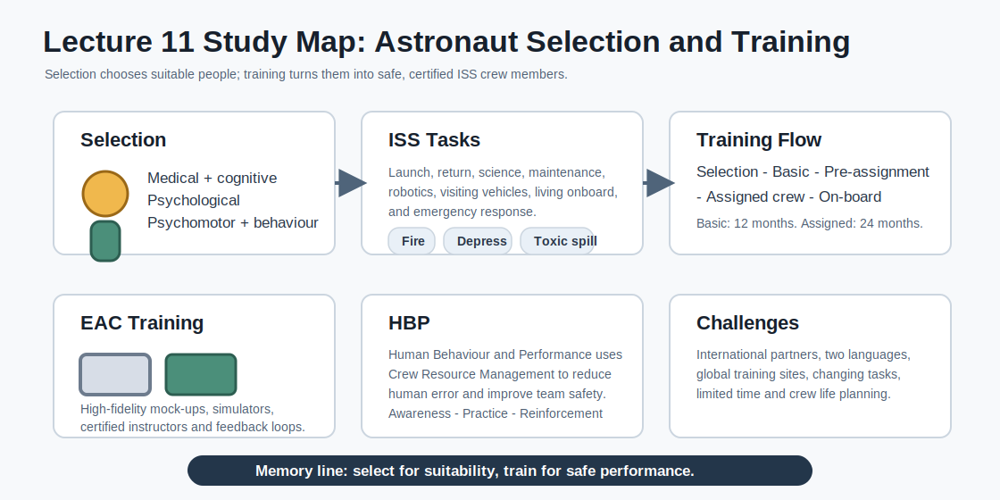

# Study Guide - Lecture 11: Astronaut Selection and Training

Source: `HiS-11-Astro-Select-Trn-May-2026.pdf`



## 1. Big Picture

This lecture explains how astronauts are selected and trained for ISS missions.

The core idea:

> Selection finds people who can become astronauts. Training turns them into safe, certified and mission-ready crew members.

Memory line:

```text
Select the person. Train the astronaut. Certify the crew member.
```

## 2. Lecture Map

| Block | Topic | Main Question |
|---|---|---|
| 1 | ISS tasks | What must astronauts be able to do? |
| 2 | Selection | How are candidates filtered? |
| 3 | EAC training | How does ESA train astronauts? |
| 4 | Training flow | What are the mission training phases? |
| 5 | HBP | Why train behaviour and teamwork? |
| 6 | Challenges | Why is ISS training difficult to manage? |

## 3. ISS Tasks That Require Training

Astronauts train for work, survival and daily life.

| Area | Examples |
|---|---|
| Transport | Launch, docking, return and landing. |
| Science | Experiments and acting as science subjects. |
| Maintenance | Repair inside the ISS and EVA outside. |
| Visiting vehicles | Capture, berthing, docking and cargo transfer. |
| Living onboard | Hygiene, food, sleep, stowage and routines. |
| Emergencies | Fire, rapid depressurisation and toxic spill. |

Memory rule:

```text
Launch - work - repair - live - survive
```

## 4. Astronaut Selection

Each space agency runs its own selection.

Selection criteria:

| Criterion | Meaning |
|---|---|
| Medical | Healthy and fit for mission risks. |
| Cognitive | Learns fast and solves problems. |
| Psychological | Stable under pressure. |
| Psychomotor | Good coordination and control. |
| Behavioural | Works well in a team. |

ESA example:

| Selection Fact | Key Point |
|---|---|
| 2009 ESA class | 6 astronauts; first ESA-wide selection. |
| 2008-2009 process | 9199 applications, 8330 valid. |
| 2021 selection | More than 22000 applications, 5 successful. |
| 2023 ESA class | Adenot, Coogan, Alvarez Fernandez, Liegeois, Sieber. |

Memory line:

> Selection is a funnel: many apply, very few pass every filter.

## 5. European Astronaut Centre

The **European Astronaut Centre (EAC)** in Cologne is ESA's astronaut training centre.

Training at EAC uses:

- Specific performance objectives.
- Certified instructors and certified lessons.
- Full-scale and high-fidelity mock-ups.
- Software simulators for nominal and off-nominal cases.
- Student and mission feedback.

Important facilities:

| Facility | Purpose |
|---|---|
| Columbus Training Facility | Training for ESA's ISS module. |
| Payload booths | Training for European experiments and racks. |
| Neutral Buoyancy Facility | EVA skill maintenance in simulated weightlessness. |

## 6. ISS Training Flow

Generic flow:

```text
Selection -> Basic Training -> Pre-assignment -> Assigned Crew Training -> On-board Training
```

| Phase | Main Function |
|---|---|
| Basic Training | Builds common astronaut foundation; about 12 months for ESA. |
| Pre-assignment | Maintains skills before a mission assignment. |
| Assigned Crew Training | Mission-specific training; about 24 months. |
| On-board Training | Keeps critical skills current during the mission. |

Memory line:

> First train the astronaut, then train the assigned crew member, then keep training in orbit.

## 7. Basic and Pre-Assignment Training

Basic Training covers:

- ESA, space programmes and space technologies.
- Science and engineering fundamentals.
- ISS systems and European contributions.
- Visiting vehicles.
- ISS operations and ground control.
- Crew health care systems.
- Media and public communication.

Pre-assignment training maintains:

- EVA skills.
- Robotics skills.
- Languages.
- EUROCOM skills.
- Analogue mission skills.

## 8. Special Skills and Analogues

| Training Type | Purpose |
|---|---|
| Robotics | Robotic arm use, cameras, clearances, reference frames and situational awareness. |
| Parabolic flights | First experience with weightlessness and body control. |
| EVA training | Tools, safety rules and work in simulated weightlessness. |
| Survival training | Preparation for off-nominal return or landing cases. |
| CAVES | Human Behaviour and Performance plus expeditionary skills. |
| PANGAEA | Geology, astrobiology, sampling and planetary field science. |

Robotics memory rule:

> Robotics is seeing, judging clearances, controlling motion and communicating clearly.

## 9. Assigned Crew Training

Assigned Crew Training is tailored to each crew member and coordinated among ISS partners.

Main training centres:

| Partner | Centre |
|---|---|
| ESA | European Astronaut Centre, Cologne. |
| NASA | Johnson Space Center, Houston. |
| Roscosmos | Star City, Moscow. |
| JAXA | Tsukuba Space Centre. |

Important concepts:

| Concept | Meaning |
|---|---|
| MCOP | Multilateral Crew Operations Panel; decides who flies and when. |
| Crew Rotation Plan | The plan an assigned astronaut joins after assignment. |
| CQRM | Crew Qualification and Responsibilities Matrix; distributes tasks safely. |
| User / Operator / Specialist | Increasing levels of training depth. |

## 10. On-Board Training

On-board training happens during the mission.

Used for:

- Emergency drills with Flight Control Teams.
- Fire, depressurisation and toxic-spill response.
- Proficiency maintenance for critical skills.
- Preparation for unplanned repairs.

Tradeoff:

> It is very realistic, but it uses valuable crew time.

## 11. Human Behaviour and Performance

**HBP** means Human Behaviour and Performance.

Purpose:

> HBP trains behaviours that improve team safety, operational effectiveness and use of available resources.

It is based on Crew Resource Management and is taught to:

- Astronauts.
- EUROCOMs.
- Flight Directors.
- Flight Controllers.

HBP teaching loop:

```text
Awareness -> Practice -> Reinforcement
```

Spaceflight stressors:

| Category | Examples |
|---|---|
| Physical | Radiation, microgravity, sleep disturbance. |
| Psychological | Isolation, confinement, high risk. |
| Psychosocial | Crew-ground tension, multicultural issues, family disruption. |
| Human factors | Workload, limited information, interface problems. |
| Habitability | Noise, privacy limits, hygiene limits, food restrictions. |

## 12. ISS Training Challenges

ISS training is hard because it is international, continuous and always changing.

| Challenge | Why It Matters |
|---|---|
| Many partners | NASA, Roscosmos, ESA, JAXA and CSA must coordinate. |
| Languages and cultures | Training must work across different operational cultures. |
| Global sites | Crew travel between Europe, USA, Russia and Japan. |
| Time pressure | Assigned Crew Training is limited to about 24 months. |
| Dynamic missions | Tasks, vehicles and crew plans can change. |
| Crew life planning | Training affects travel, family life and holidays. |

Memory rule:

> ISS training is not one course. It is a long international logistics problem.

## 13. What You Must Know for the Exam

Use this checklist:

- Know what astronauts must train for: transport, science, maintenance, visiting vehicles, living onboard and emergencies.
- Know the emergency trio: fire, depressurisation, toxic spill.
- List the selection criteria: medical, cognitive, psychological, psychomotor and behavioural.
- Explain the ESA selection funnel and why it is highly competitive.
- Know the role of EAC and its main facilities.
- Describe the training flow: Basic, Pre-assignment, Assigned Crew, On-board.
- Remember the durations: Basic about 12 months, Assigned Crew about 24 months.
- Explain robotics, EVA, parabolic flights, CAVES and PANGAEA.
- Define MCOP, CQRM and User / Operator / Specialist.
- Define HBP and its loop: Awareness, Practice, Reinforcement.
- Explain why ISS training is difficult to coordinate.

## 14. Flashcards

**What is the purpose of astronaut selection?**  
To find candidates medically, cognitively, psychologically and behaviourally suitable for spaceflight.

**What are the five ISS partners?**  
NASA, Roscosmos, ESA, JAXA and CSA.

**What are the three main emergency cases?**  
Fire, rapid depressurisation and toxic spill.

**How long is ESA Basic Training?**  
About 12 months.

**How long is Assigned Crew Training?**  
About 24 months.

**What is EAC?**  
ESA's astronaut training centre in Cologne.

**What is CAVES?**  
A space analogue for behaviour, teamwork and expeditionary skills.

**What is PANGAEA?**  
Planetary analogue training for geology, astrobiology and field science.

**What does MCOP decide?**  
Who flies and when.

**What is CQRM?**  
The Crew Qualification and Responsibilities Matrix.

**What are the three training levels?**  
User, Operator and Specialist.

**What is HBP?**  
Human Behaviour and Performance: behaviour and teamwork training for safer operations.

## 15. The Whole Lecture in 10 Sentences

1. Astronaut selection identifies people suitable for the medical, cognitive and behavioural demands of spaceflight.
2. ISS astronauts train for launch, return, science, maintenance, visiting vehicles, daily life and emergencies.
3. The key emergency cases are fire, rapid depressurisation and toxic spill.
4. ESA trains astronauts at the European Astronaut Centre using certified lessons, mock-ups and simulators.
5. Basic Training builds a common foundation and lasts about 12 months for ESA astronauts.
6. Pre-assignment training maintains skills such as EVA, robotics, languages and analogues.
7. Assigned Crew Training is mission-specific, international and lasts about 24 months.
8. On-board training is realistic but consumes crew time.
9. HBP trains crew and ground teams to reduce human error and improve teamwork under stress.
10. ISS training is complex because many partners, languages, cultures, sites, vehicles and changing tasks must be coordinated.
