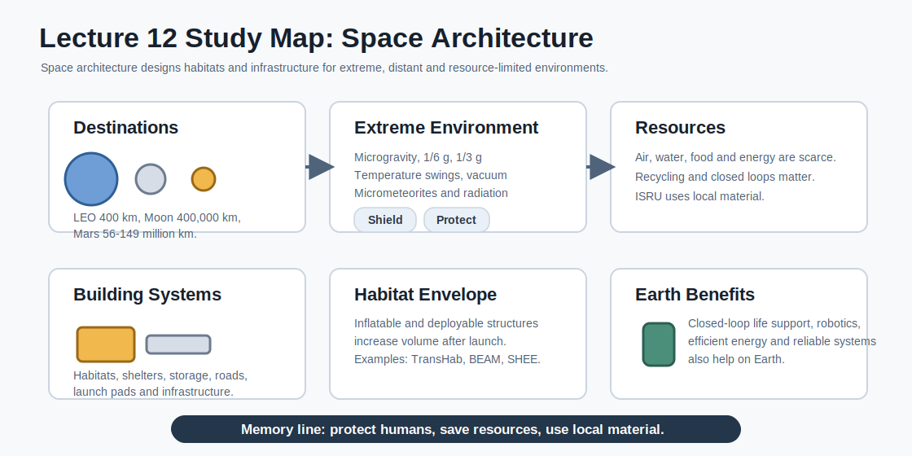

# Study Guide - Lecture 12: Space Architecture

Source: `HiS-12- IMHOF Human Spaceflight TUM withoutvideos.pdf`



## 1. Big Picture

This lecture explains how architecture changes when humans live and work in space.

The core idea:

> Space architecture designs habitats, infrastructure and life-supporting environments for places that are distant, dangerous and resource-limited.

Memory line:

```text
Space architecture = human needs + extreme environment + limited resources.
```

## 2. Lecture Map

| Block | Topic | Main Question |
|---|---|---|
| 1 | Destinations | How far are orbit, Moon and Mars? |
| 2 | Extreme environment | What must habitats protect against? |
| 3 | Living challenges | Why are transport, space and resources limiting? |
| 4 | Building systems | What kinds of structures are needed? |
| 5 | Habitat envelopes | Why use inflatable or deployable systems? |
| 6 | ISRU and dual use | How can local resources and space technologies help? |

## 3. Destinations and Distances

| Destination | Key Distance |
|---|---|
| Outer space | Above 100 km, the Karman line. |
| Low Earth Orbit | Below 2,000 km; ISS is about 400 km. |
| Moon | About 400,000 km. |
| Mars | About 56-149 million km. |

Memory rule:

> LEO is near, the Moon is far, Mars is a different scale.

## 4. Extreme Environment

Space architecture must respond to:

| Factor | Design Problem |
|---|---|
| Gravity | Microgravity in orbit, 1/6 g on the Moon, 1/3 g on Mars. |
| Temperature | Large swings between shadow and sunlight. |
| Vacuum | Pressure difference and thermal problems. |
| Micrometeorites | High-speed impacts can damage structures. |
| Cosmic rays | Harmful to humans and hardware. |

Short version:

```text
Gravity - temperature - vacuum - impacts - radiation
```

## 5. Challenges for Building and Living

| Challenge | Meaning |
|---|---|
| Transport | Long distances, difficult supply, delayed communication and launch loads. |
| Shortage of space | Living volume is limited; deployable structures help. |
| Shortage of resources | Air, water and food must be supplied, recycled or produced. |

Key concept:

> In space, every kilogram, cubic meter and resource loop matters.

## 6. Design Strategies

Space architecture uses several strategies:

- Compact launch configuration.
- Deployable or inflatable volume after launch.
- Radiation shielding.
- Closed-loop life support.
- Recycling of air, water and materials.
- ISRU: in-situ resource utilisation.
- 3D printing or sintering with local material.
- Modular habitats and supporting infrastructure.

Memory line:

> Launch small, deploy large, protect well, reuse everything.

## 7. Building Systems

Main applications:

| System | Purpose |
|---|---|
| Habitats | Human living and working space. |
| Storage facilities / shelters | Protection for equipment, supplies or crew. |
| Supporting infrastructure | Roads, landing pads, launch pads and surface systems. |

Planning considerations:

- Habitation suitability.
- Operational suitability and economy.
- Safety.
- Mission and application requirements.
- Evaluation of design options.

## 8. Habitat Envelopes

Inflatable and deployable habitats increase usable volume after launch.

Examples from the lecture:

| Example | Key Idea |
|---|---|
| TransHab | Inflatable module concept with multiple protective layers. |
| BEAM | Inflatable module example attached to the ISS. |
| SHEE | Self-Deployable Habitat for Extreme Environments. |
| FLECS | Foldable Living Environment for Crew Systems. |
| I-HAB | Gateway habitat concept. |

TransHab layer logic:

```text
Insulation -> debris protection -> restraint -> pressure bladder -> inner wall
```

## 9. ISRU and Surface Construction

**ISRU** means using resources found at the destination.

Lecture examples:

- Sunlight.
- Regolith, meaning loose surface sand or dust.
- Solar sintering.
- Additive layer manufacturing or 3D printing.
- Regolith-based elements for habitats, shelters, roads and launch pads.

Why it matters:

> If you can build with local material, you reduce what must be launched from Earth.

## 10. Life Support, Food and Living Architecture

Space habitats need more than walls.

Important ideas:

- Closed-loop life support saves air, water and resources.
- Greenhouses and hydroponics can support food production.
- EDEN ISS is an example of controlled-environment food production.
- Living architecture explores habitats as active, programmable environments rather than passive shells.

Memory rule:

> A habitat is not just a container. It must support metabolism, work, privacy, health and survival.

## 11. Dual-Use Technologies

Human Mars mission technologies can also help on Earth.

| Space Challenge | Mars Technology Need | Earth Benefit |
|---|---|---|
| Microgravity and radiation | Protection and treatments. | Illness prevention and construction technologies. |
| Scarce air, water and resources | Closed-loop life support. | Resource management. |
| Scarce energy | Efficient energy systems. | Low-energy products. |
| Safety and health risks | Automation and robotics. | Automated technologies. |
| Extreme conditions | Reliable, low-maintenance systems. | Reliable infrastructure. |

## 12. What You Must Know for the Exam

Use this checklist:

- Know the main distances: Karman line, LEO, Moon and Mars.
- Explain why space is an extreme architectural environment.
- List the main environmental threats: gravity, temperature, vacuum, micrometeorites and radiation.
- Explain why transport, volume and resources dominate design.
- Know why recycling and closed-loop systems matter.
- Define ISRU and explain why regolith is important.
- Explain why deployable and inflatable habitats are useful.
- Know examples: TransHab, BEAM, SHEE, FLECS, I-HAB, RegoLight and EDEN ISS.
- Explain the purpose of habitats, shelters, storage and surface infrastructure.
- Explain how space technologies can have Earth applications.

## 13. Flashcards

**What is space architecture?**  
Designing habitats and infrastructure for humans in extreme space environments.

**Where does outer space begin in the lecture?**  
Above 100 km, at the Karman line.

**How far is the ISS approximately?**  
About 400 km in Low Earth Orbit.

**How far is the Moon approximately?**  
About 400,000 km.

**What are the main environmental threats?**  
Gravity conditions, temperature extremes, vacuum, micrometeorites and cosmic rays.

**What does ISRU mean?**  
In-situ resource utilisation: using local resources at the destination.

**Why is regolith important?**  
It can be used as local material for construction, shielding or surface infrastructure.

**Why use inflatable habitats?**  
They launch compactly and provide larger volume  after deployment.

**What is the basic TransHab layer logic?**  
Insulation, debris protection, restraint, pressure bladder and inner wall.

**Why are closed-loop systems important?**  
They reduce the need to bring air, water and resources from Earth.

## 14. The Whole Lecture in 10 Sentences

1. Space architecture designs human environments for orbit, the Moon and Mars.
2. Distance changes everything because transport, supply and communication become difficult.
3. Space habitats must protect against gravity differences, temperature extremes, vacuum, impacts and radiation.
4. Living space is limited, so deployable and inflatable systems are valuable.
5. Resources are scarce, so recycling and closed-loop life support are central.
6. Building systems include habitats, shelters, storage and supporting infrastructure.
7. Radiation shielding and safe construction methods are basic design concerns.
8. ISRU reduces Earth launch mass by using local resources such as regolith and sunlight.
9. Projects such as TransHab, BEAM, SHEE, RegoLight and EDEN ISS show different habitat and resource strategies.
10. Technologies for human spaceflight can also improve resource management, energy efficiency, robotics and reliability on Earth.
